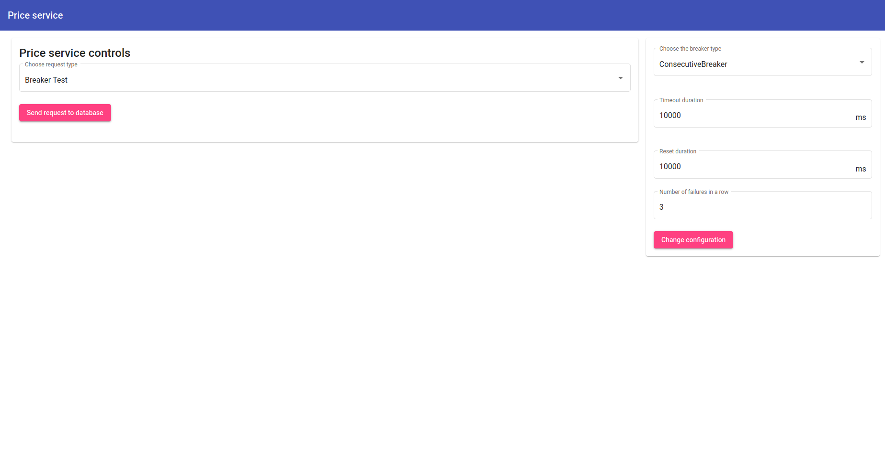
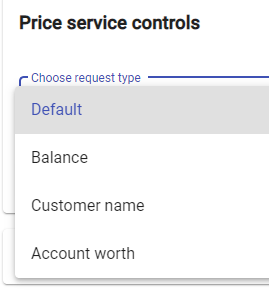
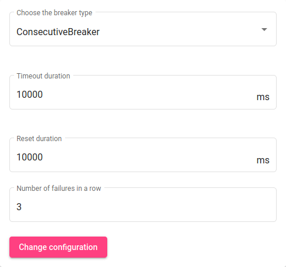

# Price service

## Frontend

### Installation

```bash
$ npm install
```
### Running the app

```bash
$ ng serve
```
### Using the app

For a more detailed description of all functionalities visit the the Price Service section of out [Github Pages Documentation](https://ccims.github.io/overview-and-documentation/price-service).

```
The frontend is running at http://localhost:4300
```

```
The app allows to send GET requests to the database service.
The requests are monitored by a circuit breaker that watches for errors in the requests.
There are different endpoints that the GET request can be send to.
These can be selected in the "Choose request type" selector.
```

```
The circuit breaker has two different types that can be configured:

The ConsecutiveBreaker opens after n requests.
```

```
The SamplingBreaker opens after a percentage of requests fails within a certain time period.
```


## Backend

### Installation

```bash
$ npm install
```
#### Swagger IO Documentation 
run:
```bash
$ npm install --save @nestjs/swagger swagger-ui-express
```

At http://localhost:3300/api you can see all the API Endpoints, generated from the Swagger IO. 

At http://localhost:3300/api-json is the Swagger JSON file.

### Running the app

```bash
# development
$ npm run start

# watch mode
$ npm run start:dev

# production mode
$ npm run start:prod
```

### Using the app

For a more detailed description of all functionalities visit the the Price Service section of out [Github Pages Documentation](https://ccims.github.io/overview-and-documentation/price-service).

```
The backend listens at http://localhost:3300/request for the incoming default GET requests and automatically transfers them to backend of database service (usually sitting ad http://localhost:3000 when running). 

- from http://localhost:3000/request-handler/balance to get the balance from the database service.

- from http://localhost:3000/request-handler/customer-name to get the customer name from the database service


The backend listens at http://localhost:3300/config/ for a POST request containing the breaker config

The breaker config should have the following format:

    breaker : string;
    timeoutDuration : number;
    resetDuration : number;
    monitorDuration : number;
    threshold : number;
    minimumRequests : number;
    consecutiveFailures : number;
```
